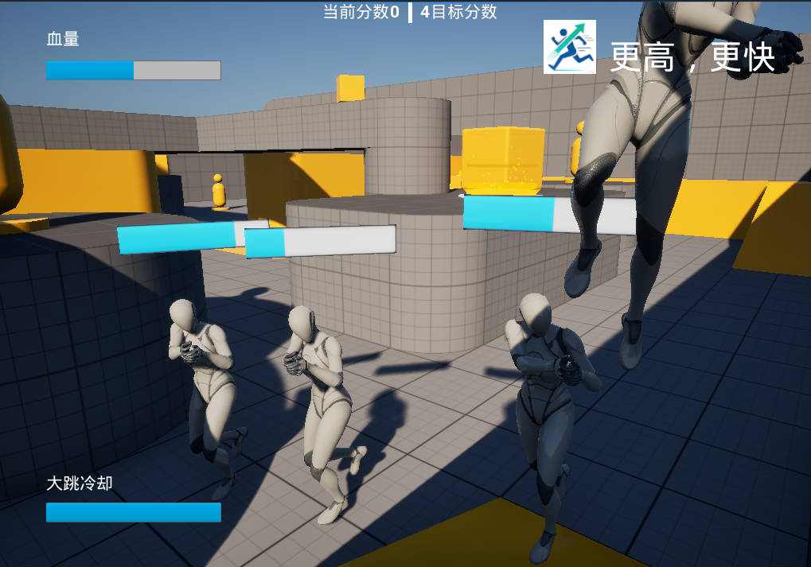
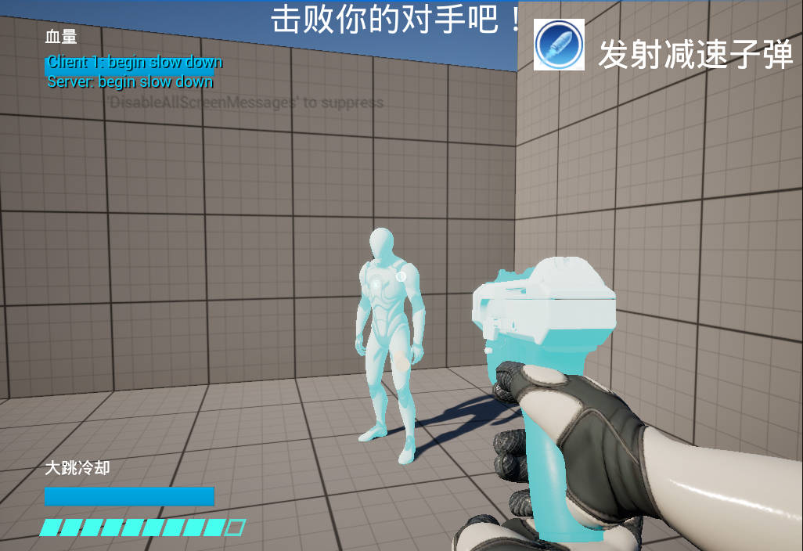
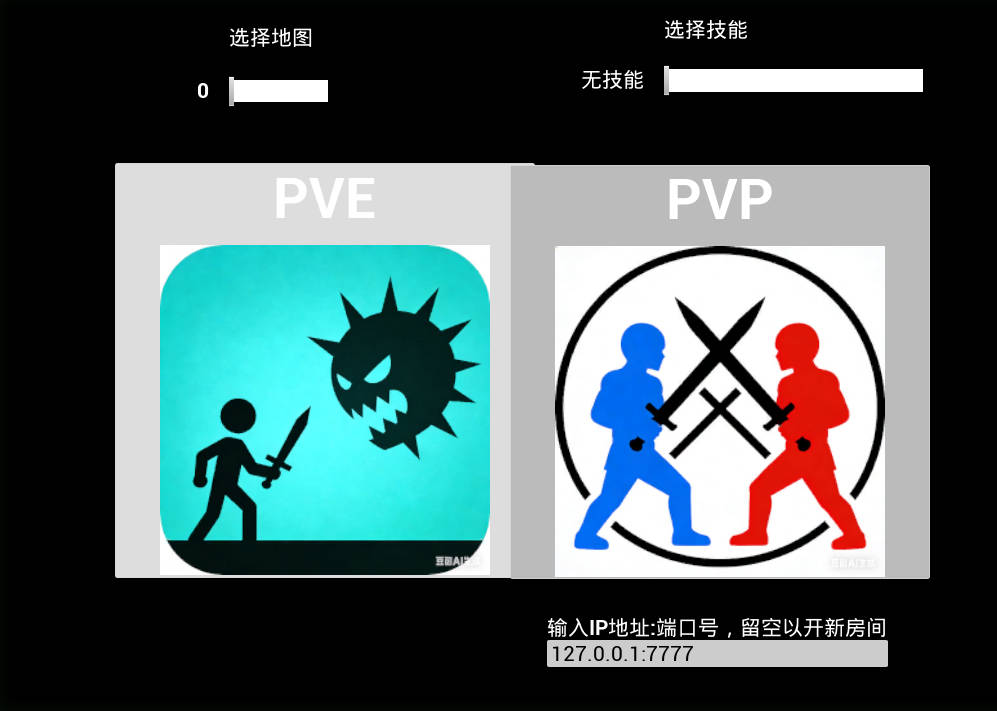
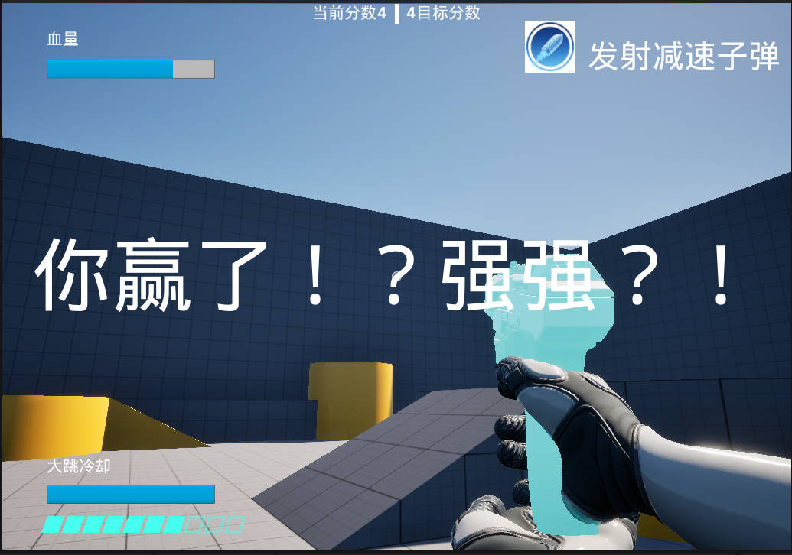
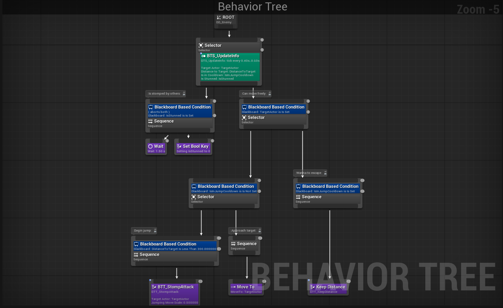

# HeadStomp 蹦蹦头锤

## 核心玩法介绍

只有踩到敌人的头上，才能对其造成伤害！

跳跃的能力是十分宝贵的资源，每个角色都有跳跃冷却，冷却过程中只能进行小幅度跳跃，不足以跳到敌人头上；只有冷却完成才能实施强而有力的大跳。

每个角色的头都是很有弹性的，踩到头后就会被弹飞。被踩的角色可以趁机逃跑，踩人的角色也可以在空中调整位置，打出连招。

目前有三种职业可以选择：

- **威猛先生：** 移动速度更快，跳跃高度更高。但因为吨位大，踩到头后难以被再次高高弹起；
    
    
    
    > *使用威猛先生在PVE模式中面对来势汹汹的敌人*
    > 
- **寒冰术士：** 拥有一把冰霜手枪，可以发射寒冰子弹令敌人减速。但因为太冷了，大跳冷却更长；
    
    
    
    > *使用寒冰术士在PVP模式中将对手减速*
    > 
- **迭步舞者：** 身形灵活，大跳冷却更短。

## 技术实现介绍

### 踩头相关机制实现

该部分的技术要点主要分为三部分：踩头判定、跳跃冷却、伤害与扣血。

- **踩头判定：**
    - 角色胶囊体的顶部大小对踩头来说过于严苛，需要一个更宽松的判定。胶囊体与`CharacterMovementComponent`绑定，不宜随意修改，因此项目在`ACharacter`的基础上继承了`AHSBaseCharacter`类，添加了一个盒型碰撞箱，并设为触发型，仅用于检测。
    - 对踩头方，在`OnCapsuleOverlap` 方法中检测与自身胶囊体重叠的组件是否是另一个角色的头部碰撞箱；对被踩方，在`OnHeadHitBoxOverlap` 里检测与自身头部碰撞箱重叠的组件的拥有者是否是另一个角色。
    - 除此之外，二者还共用了一套逻辑来额外判断碰撞箱的重叠是否能认定为“踩”，避免只是蹭到却同样触发判定。具体分为两部分：
        - 判断踩头方相较于被踩方的相对速度的Z值是否为负；
        - 判断重叠时的法方向向量与垂直方向的夹角是否在一定范围内（如设定为45°）
- **跳跃冷却：**
    - 跳跃分为两种，一种是可随意使用的小跳，一种是需要冷却才可以使用的大跳。冷却计时使用`FTimerHandle`实现，在`AHSBaseCharacter` 重写的`Landed` 方法中检测如果落地且确实是地面（而不是其他角色），则重新开始冷却。大跳的实现方式是在可以大跳时修改`CharacterMovementComponent` 的`JumpZVelocity`。
- **伤害与反弹：**
    - UE为Actor内置了伤害机制，可以轻松地通过监听`OnTakeAnyDamage` 等事件函数获取自身被造成的伤害。而本项目还将其视为一个**较为通用的Actor间数据通信方式**，通过使用不同的`UDamageType` 区分不同目的的通信。
    - 踩头时，踩头方仅向被踩头方传递“血量伤害”，由被踩方自行决定如何处理这一伤害。在项目里，角色的血量由一个包含血量数据的`HealthComponent` 进行管理。
    - 同时，被踩头方也会向踩头方传递“反弹伤害”，而该“伤害”并不会导致血量降低，而是在角色的`StompImpulseComponent` 中，通过`LaunchCharacter`给自己一个水平方向随机的向上冲力。其在Z轴方向的大小由伤害数值和组件自身存储的基础数值相乘得到。

### 职业选择与职业机制实现

- **主界面与职业选择：**
    - 本项目有一个简单的主界面，用于选择游戏模式、职业和地图。本项目在`OpenLevel` 的option参数中传入职业对应的字符串，并通过重写`GameMode`的`Login` 函数进行解析，将职业信息存入`PlayerController`包含的`PlayerState`中。后续的角色分配、UI展示就都通过查询`PlayerState` 实现。
    - 在`OpenLevel` 的option参数中同时也指定了关卡使用的GameMode（`?game=`）、是否以服务器运行（`?listen`）来区分其他数据。
        
        
        
        > *简陋的主界面*
        > 
- **威猛先生、迭步舞者的实现**
    - 不同职业的角色在多种数值上都有所不同，因此项目选择根据职业直接给予玩家不同的角色蓝图类。这一目的通过重写GameMode的`GetDefaultPawnClassForController` 实现。
    - 该两个角色的实现较为简单，只需修改部分默认数值即可。
- **寒冰术士的实现**
    - 寒冰术士需要手持冰霜手枪，本项目通过复用UE5 FirstPerson模板的`Variant_Shooter`部分代码和蓝图资源实现。
    - 寒冰术士发射的子弹对角色的减速效果同样通过伤害机制实现。子弹击中角色时，角色拥有的`SlowDownComponent` 处理”减速伤害“，将伤害作为百分比乘到运动组件的`MaxWalkSpeed` 上，同时开启一个`FTimerHandle` ，经过固定时间后取消减速，途中若再次受到减速则冷却重置。
    - 为了明显地体现出减速效果，`SlowDownComponent` 还将角色变蓝。具体通过在角色身上叠加一层Overlay Material实现。该材质目前只是简单地将`Emissive Color`设为半透明蓝色，从而体现出被冰覆盖的效果。该材质同样用在了寒冰术士的手枪和子弹上。
        
        
        
        > *寒冰术士手持冰霜手枪迎接胜利*
        > 

### PVE模式玩法与敌人实现

- **动态敌人生成与获胜机制：**
    - 为了实现同一地图可同时用于PVE模式和PVP模式，项目并没有在场景中直接放置敌人，而是在`DataAsset` 中存储敌人信息（蓝图类、生成位置），并通过PVE模式的GameMode动态生成。这同时也便于记录目标分数和当前分数，用来判断输赢。
        
        
        
        > *迭步舞者被NPC击败*
        > 
- **敌人AI实现：**
    
    项目使用行为树实现了一个简单的敌人AI。其主要分为以下几个节点：
    
    - **被踩后顿住：** 优先级最高，顿住一段时间（Wait），然后解除顿住状态。
    - **靠近玩家：** 当不在大跳冷却期间时尝试靠近玩家（MoveTo），足够近后跳跃。默认的AI在跳跃期间不会进行水平方向移动，因此在该任务中还通过`AddMovementInput`手动给AI一个向玩家方向的推力。
    - **保持距离：** 当处于大跳冷却期间时尝试远离玩家，具体为侧向移动到距玩家一定半径的圆周上，同时加入一些随机数避免移动过程过于僵硬。
        
        
        

### PVP模式玩法与联机实现

- **PVP获胜机制：**
    - 目前实现了简单的双人对战模式。在PVP模式GameMode的`OnPostLogin` 中存储加入的玩家的`PlayerController`。当玩家达到2人时便通过存储的`PlayerController`向客户端发送信息提醒开战，同时当一方死亡时通过比对`PlayerController` 决定胜负。
- **联机一致性处理：**
    - 关键变量设为**Replicated**（如玩家选择的职业、决定是否在跳跃冷却期间的布尔变量）或**RepNotify**（如`HealthComponent`存储的血量数据，通过Notify更新UI）；一些动态生成的物体还需要**Replicate Movement**，如寒冰术士发射的子弹。
    - 与玩家输入相关的部分需要格外注意网络同步。
        - 本项目对跳跃进行了特殊处理，因此在触发跳跃时，通过ServerRPC通知服务器角色起跳，同时自行先起跳以避免网络延迟造成的手感差异。
        - FirstPerson模板自带的Shooter并不支持联机，因此在实现寒冰术士时对齐进行了修改，一方面在`ShooterCharacter`中将`Fire`的输入交由服务器进行，另一方面`ShooterWeapon` 发射子弹的动作也需要由服务器验证冷却、弹匣等是否合理。
        - `ApplyDamage`仅在权威服务器上执行，为了客户端感知伤害，项目一方面通过**RepNotify**通知数据变更，另一方面也通过**NetMulticast**通知客户端执行相应逻辑（如寒冰术士减速的材质叠加）。

### 可以改进的地方

限于时间，本项目还有很多不完善的地方，可待改进的点包括但不限于以下几点：

- 踩头的判定还是比较简陋，宜引入骨骼相关的事件进行更细致的判定；
- 敌人AI也很简陋，且目前是直接获取玩家位置进行移动，之后可以引入UE的Percetion感知机制进行完善；
- 网络同步缺乏严密的考证和部分鉴权，有较大改善空间。
- UGameplayStatics::ApplyDamage在数据传递上仅能传递一个单一的float数值和静态的伤害类型，灵活性有限。如果想要继续依赖伤害机制进行数据传递，宜自己封装一套接口，在DamageEvent里传入更多信息。